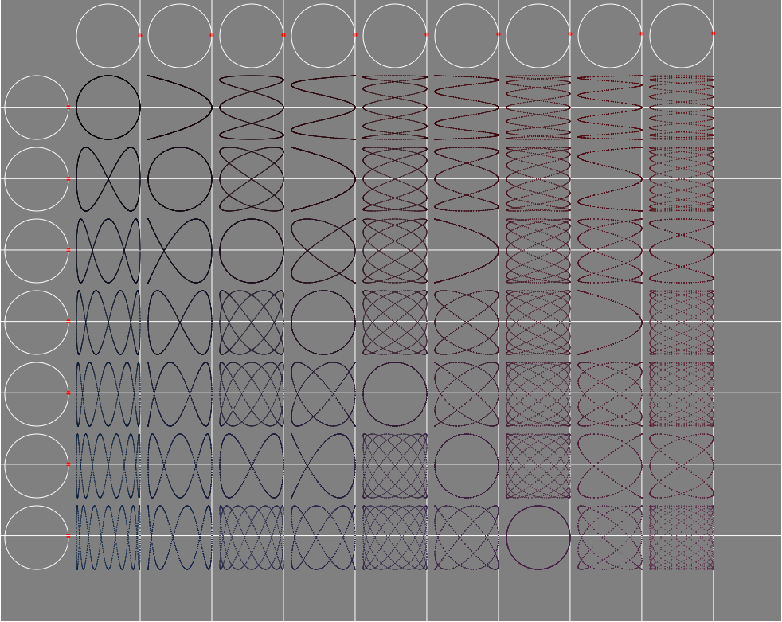

# -JavaFX-Lissajous-curves-simulation
Simule les courbes de Lissajous.

Voici un petit projet que j'ai rapidement réalisé après avoir visionné la vidéo de Daniel Shiffman:
Coding Challenge #116: Lissajous Curve Table - https://www.youtube.com/watch?v=--6eyLO78CY.

Ce projet a pour but de créer un tableau de courbes de lissajous (cf: https://fr.wikipedia.org/wiki/Courbe_de_Lissajous).

Pour se faire le programme pose des cercles le long en haut et sur le côté gauche.

Un point rouge est placé sur le côté droit de chacun des cercles, et tourne autour de celui-ci.
Le cercle le plus à gauche et le plus en haut est le plus lent.
Le cercle le plus à droite et le plus en bas est le plus rapide.

Les points des cercles du haut représentent l'abscisse d'une droite d.
Les points des cercles de gauche représentent l'ordonnée d'une droite d'.
Le point d'intersection de d et d' est ajouté à la figure représantant la case (lieu d'intersection d'un cercle du haut avec un cercle de bas).

L'animation s'arrête quand le point du cercle le plus lent (en haut à gauche) a fait un tour.

Première fois que j'utilise les canvas en JavaFX et l'animation de ceux-ci.